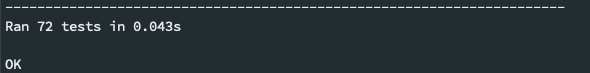

Testing and Software Organization
==================================

4.1 Test ``Undefined``
------------------------

Both ``TravisCI`` and ``CodeCov`` are used for testing suit monitoring, and the package is available in ``PyPI``.

``src`` folder is where we house our core modules, which include the following:

``UDFunction.py``: We overload the operators in this file, such as ``__add__``.
``GraphGenerator.py``: This is where we mainly achieved the reverse mode. 
``Calculator.py``: We defined the calculation, such as ``sin``, ``cos``, ``tan``, ``sqrt``, and ``exp``. 
``Utils.py``: This file contains the helper functions. 
``API.py``: We defined the ``trace`` function here to wrap all the calculation required for the users defined function. 

``test`` folder is where we house our test suits, which contains a test file for each python files inside the ``src`` folder. 
We have developed the tests based on the unit test concept and the integration concept, meaning we tested for the basic functionality and also combined with other operations. 

We developed a bash script to run all the tests, including the tests written under unit test concept and the integration test concept. You can test them by using the following examples:

Because we provided a command-line friendly user interface, we expect the consumer and the developers to interact with the package in the same way.
Moreover, the developers could index our derivative results for their subsequent use. 
Since we distributed the package via ``PyPI``, we provided an easy installation for both consumers and developers in modern computers.

Assuming you have ``git clone`` our repository and your current directory is the root directory, you can run the following codes to run the test cases we developed for ``Undefined``.

.. code-block:: 
    :linenos:

    # run test suits in your command line terminal
    bash test/run_tests.sh coverage

And you will see the following as output:

4.2 The directory structure looks like the following
--------------------------------------------------------

The tree structure of the entire project folder.

.. code-block::
    :linenos:

    .
    ├── LICENSE
    ├── README.md
    ├── __init__.py
    ├── codecov.yml
    ├── dist
    │   ├── undefined_AD-2.1.0-py3-none-any.whl
    │   └── undefined_AD-2.1.0.tar.gz
    ├── docs
    │   ├── documentation
    │   │   ├── Makefile
    │   │   ├── README.md
    │   │   ├── _build
    │   │   │   ├── doctrees
    │   │   │   │   ├── README.doctree
    │   │   │   │   ├── about.doctree
    │   │   │   │   ├── cs107-FinalProject.doctree
    │   │   │   │   ├── cs107-FinalProject.test.doctree
    │   │   │   │   ├── environment.pickle
    │   │   │   │   ├── implementation.doctree
    │   │   │   │   ├── index.doctree
    │   │   │   │   ├── modules.doctree
    │   │   │   │   ├── organization.doctree
    │   │   │   │   ├── sphinx_files
    │   │   │   │   │   ├── about.doctree
    │   │   │   │   │   ├── implementation.doctree
    │   │   │   │   │   ├── index.doctree
    │   │   │   │   │   ├── modules.doctree
    │   │   │   │   │   ├── organization.doctree
    │   │   │   │   │   ├── undefined.doctree
    │   │   │   │   │   └── usage.doctree
    │   │   │   │   ├── undefined.doctree
    │   │   │   │   └── usage.doctree
    │   │   │   └── html
    │   │   │       ├── README.html
    │   │   │       ├── _images
    │   │   │       │   ├── computational_graph_1.png
    │   │   │       │   ├── computational_graph_2.png
    │   │   │       │   ├── finalmilestone_test_success.png
    │   │   │       │   ├── milestone2_test_success.png
    │   │   │       │   ├── reverse_mode_example1.png
    │   │   │       │   ├── reverse_mode_example2.png
    │   │   │       │   └── undefined_workflow.png
    │   │   │       ├── _modules
    │   │   │       │   ├── index.html
    │   │   │       │   └── undefined
    │   │   │       │       ├── API.html
    │   │   │       │       ├── Calculator.html
    │   │   │       │       ├── GraphGenerator.html
    │   │   │       │       ├── UDFunction.html
    │   │   │       │       └── Utils.html
    │   │   │       ├── _sources
    │   │   │       │   ├── README.md.txt
    │   │   │       │   ├── about.rst.txt
    │   │   │       │   ├── cs107-FinalProject.rst.txt
    │   │   │       │   ├── cs107-FinalProject.test.rst.txt
    │   │   │       │   ├── implementation.rst.txt
    │   │   │       │   ├── index.rst.txt
    │   │   │       │   ├── modules.rst.txt
    │   │   │       │   ├── organization.rst.txt
    │   │   │       │   ├── sphinx_files
    │   │   │       │   │   ├── about.rst.txt
    │   │   │       │   │   ├── implementation.rst.txt
    │   │   │       │   │   ├── index.rst.txt
    │   │   │       │   │   ├── modules.rst.txt
    │   │   │       │   │   ├── organization.rst.txt
    │   │   │       │   │   ├── undefined.rst.txt
    │   │   │       │   │   └── usage.rst.txt
    │   │   │       │   ├── undefined.rst.txt
    │   │   │       │   └── usage.rst.txt
    │   │   │       ├── _static
    │   │   │       │   ├── alabaster.css
    │   │   │       │   ├── basic.css
    │   │   │       │   ├── css
    │   │   │       │   │   ├── badge_only.css
    │   │   │       │   │   ├── fonts
    │   │   │       │   │   │   ├── Roboto-Slab-Bold.woff
    │   │   │       │   │   │   ├── Roboto-Slab-Bold.woff2
    │   │   │       │   │   │   ├── Roboto-Slab-Regular.woff
    │   │   │       │   │   │   ├── Roboto-Slab-Regular.woff2
    │   │   │       │   │   │   ├── fontawesome-webfont.eot
    │   │   │       │   │   │   ├── fontawesome-webfont.svg
    │   │   │       │   │   │   ├── fontawesome-webfont.ttf
    │   │   │       │   │   │   ├── fontawesome-webfont.woff
    │   │   │       │   │   │   ├── fontawesome-webfont.woff2
    │   │   │       │   │   │   ├── lato-bold-italic.woff
    │   │   │       │   │   │   ├── lato-bold-italic.woff2
    │   │   │       │   │   │   ├── lato-bold.woff
    │   │   │       │   │   │   ├── lato-bold.woff2
    │   │   │       │   │   │   ├── lato-normal-italic.woff
    │   │   │       │   │   │   ├── lato-normal-italic.woff2
    │   │   │       │   │   │   ├── lato-normal.woff
    │   │   │       │   │   │   └── lato-normal.woff2
    │   │   │       │   │   └── theme.css
    │   │   │       │   ├── custom.css
    │   │   │       │   ├── doctools.js
    │   │   │       │   ├── documentation_options.js
    │   │   │       │   ├── file.png
    │   │   │       │   ├── jquery-3.5.1.js
    │   │   │       │   ├── jquery.js
    │   │   │       │   ├── js
    │   │   │       │   │   ├── badge_only.js
    │   │   │       │   │   ├── html5shiv-printshiv.min.js
    │   │   │       │   │   ├── html5shiv.min.js
    │   │   │       │   │   └── theme.js
    │   │   │       │   ├── language_data.js
    │   │   │       │   ├── minus.png
    │   │   │       │   ├── plus.png
    │   │   │       │   ├── pygments.css
    │   │   │       │   ├── searchtools.js
    │   │   │       │   ├── tabs.css
    │   │   │       │   ├── tabs.js
    │   │   │       │   ├── underscore-1.13.1.js
    │   │   │       │   └── underscore.js
    │   │   │       ├── about.html
    │   │   │       ├── cs107-FinalProject.html
    │   │   │       ├── cs107-FinalProject.test.html
    │   │   │       ├── genindex.html
    │   │   │       ├── implementation.html
    │   │   │       ├── index.html
    │   │   │       ├── modules.html
    │   │   │       ├── objects.inv
    │   │   │       ├── organization.html
    │   │   │       ├── py-modindex.html
    │   │   │       ├── search.html
    │   │   │       ├── searchindex.js
    │   │   │       ├── sphinx_files
    │   │   │       │   ├── about.html
    │   │   │       │   ├── implementation.html
    │   │   │       │   ├── index.html
    │   │   │       │   ├── modules.html
    │   │   │       │   ├── organization.html
    │   │   │       │   ├── undefined.html
    │   │   │       │   └── usage.html
    │   │   │       ├── undefined.html
    │   │   │       └── usage.html
    │   │   ├── _static
    │   │   ├── _templates
    │   │   ├── about.rst
    │   │   ├── conf.py
    │   │   ├── implementation.rst
    │   │   ├── index.rst
    │   │   ├── make.bat
    │   │   ├── modules.rst
    │   │   ├── organization.rst
    │   │   ├── undefined.rst
    │   │   └── usage.rst
    │   ├── milestone_docs
    │   │   ├── milestone1.ipynb
    │   │   ├── milestone2.ipynb
    │   │   └── milestone2_progress.ipynb
    │   └── resources
    │       ├── computational_graph_1.png
    │       ├── computational_graph_2.png
    │       ├── finalmilestone_test_success.png
    │       ├── reverse_mode_example1.png
    │       ├── reverse_mode_example2.png
    │       └── undefined_workflow.png
    ├── htmlcov
    │   ├── coverage_html.js
    │   ├── d_40be0abedfd3bebf_Calculator_py.html
    │   ├── d_40be0abedfd3bebf_GraphGenerator_py.html
    │   ├── d_40be0abedfd3bebf_UDFunction_py.html
    │   ├── d_40be0abedfd3bebf_Utils_py.html
    │   ├── d_40be0abedfd3bebf___init___py.html
    │   ├── d_40be0abedfd3bebf___main___py.html
    │   ├── favicon_32.png
    │   ├── index.html
    │   ├── keybd_closed.png
    │   ├── keybd_open.png
    │   ├── status.json
    │   └── style.css
    ├── pyproject.toml
    ├── requirements.txt
    ├── setup.cfg
    ├── src
    │   ├── undefined
    │   │   ├── API.py
    │   │   ├── Calculator.py
    │   │   ├── GraphGenerator.py
    │   │   ├── UDFunction.py
    │   │   ├── Utils.py
    │   │   ├── __init__.py
    │   │   ├── __main__.py
    │   │   └── __pycache__
    │   │       ├── API.cpython-38.pyc
    │   │       ├── Calculator.cpython-38.pyc
    │   │       ├── GraphGenerator.cpython-38.pyc
    │   │       ├── UDFunction.cpython-38.pyc
    │   │       ├── Utils.cpython-38.pyc
    │   │       └── __init__.cpython-38.pyc
    │   └── undefined_AD.egg-info
    │       ├── PKG-INFO
    │       ├── SOURCES.txt
    │       ├── dependency_links.txt
    │       ├── requires.txt
    │       └── top_level.txt
    └── test
        ├── __init__.py
        ├── __main__.py
        ├── __pycache__
        │   ├── __init__.cpython-38.pyc
        │   ├── test_API.cpython-38.pyc
        │   ├── test_Calculator.cpython-38.pyc
        │   ├── test_UDFunction.cpython-38.pyc
        │   ├── test_graph_generator_operation.cpython-38.pyc
        │   └── test_trace.cpython-38.pyc
        ├── run_tests.sh
        ├── test_API.py
        ├── test_Calculator.py
        ├── test_UDFunction.py
        ├── test_graph_generator_operation.py
        └── test_trace.py