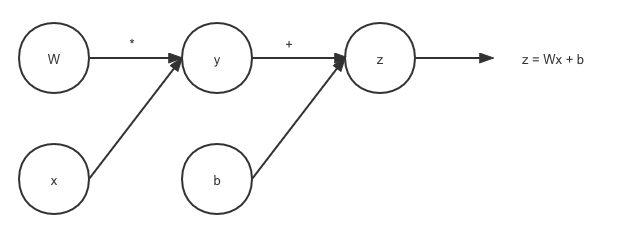

About 
========

1. Introduction
---------------------

Automatic Differentiation (AD) refers to the way to compute the derivative of a given equation automatically. It has a broad range of applications across many disciplines, such as engineering, statistics, computer science, and computational biology. For both students and researchers, it is essential for them to have tools in order to compute derivatives efficiently, given the amount of computational power needed. Here, we propose a novel Python library, undefined, to implement the AD on user defined numerical equations.

One potential application would be calculating the derivatives in the direction of negative gradient to minimize the loss function when tune parameters in training gradient machine learning models. Compared with other solutions, ``undefined`` is easier to use, single task focused and more generalized.

2. Background
---------------

As we learned in calculus classes, the traditional way to calculate derivatives is to calculate by hand and apply different rules, including power rule, product rule, chain rule, etc.

Here is an example when we need to calculate derivative by using the chain rule.

2.1 Chain Rule Formula
^^^^^^^^^^^^^^^^^^^^^^^^^^

The general formula of the chain rule is shown as following:

(1) Suppose we have a function :math:`h(u(t))`, then the derivative of this function would be shown as the following:

:math:`\frac{dh}{dt} = \frac{\partial h}{\partial u}\frac{du}{dt}`

When we have multiple coordinates, the chain rule formula will change:

(2) Suppose our formula is :math:`h(u(t), v(t))`:

:math:`\frac{dh}{dt} = \frac{\partial h}{\partial u}\frac{du}{dt} + \frac{\partial h}{\partial v}\frac{dv}{dt}`

2.2 Elementary Funciton
^^^^^^^^^^^^^^^^^^^^^^^^^^

(1) Unary elementary function examples: ``sin(x)``, ``cos(x)``

(2) Binary elemnetary function examples: ``x + y``, ``x * y``

2.3 Computational Graph
^^^^^^^^^^^^^^^^^^^^^^^^^^

A computational graph is a directed graph where the nodes correspond to elementary functions or variables.

Computational graph node for binary elementary funciton:

The computational graph grows once the computations become more complex:

2.4 Automatic Differencation
^^^^^^^^^^^^^^^^^^^^^^^^^^^^^^

Suppose we have the gradients of the function defined as following:

:math:`f(x, y) = \cos(5x + 7y)e^{-x}`

Assume we will calculate the partial derivative for x first, :math:`\frac{\partial f}{\partial x}`, we will apply the product rule first:

:math:`\frac{\partial f}{\partial x} = \cos(5x + 7y)(-e^{-x}) - 5 \sin(5x + 7y)e^{-x}`

To simplify: 

:math:`\frac{\partial f}{\partial x} = -e^{-x}(\cos(5x+7y) + 5\sin(5x+7y))`

If we would have to calculate :math:`\frac{\partial f}{\partial y}`, we only need to use the chain rule:

:math:`\frac{\partial f}{\partial y} = -7\sin(5x + 7y)e^{-x}`

Computing this function is simple, but AD will become handy when we have to compute the derivative for complicated equations. 

There are many advantages of AD compared to other ways (numerical differentiation and symbolic differentiation) to calculate derivative automatically. One of the biggest advantage of AD is that AD calculates to machine precision and comsumes efficientively than the other two methods. 